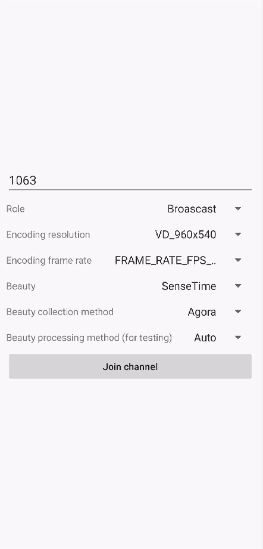
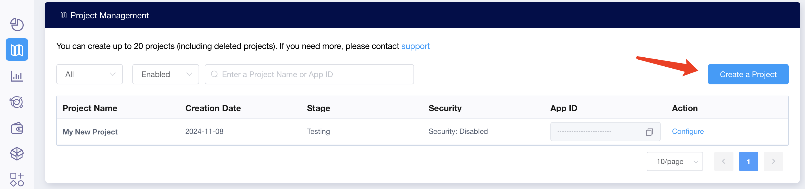
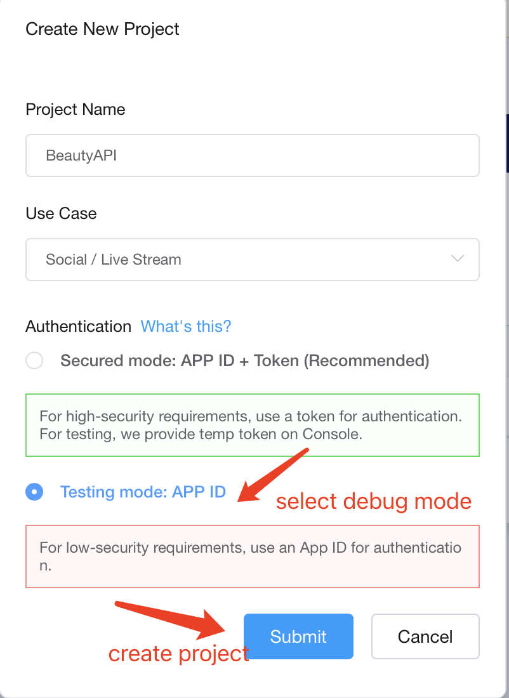
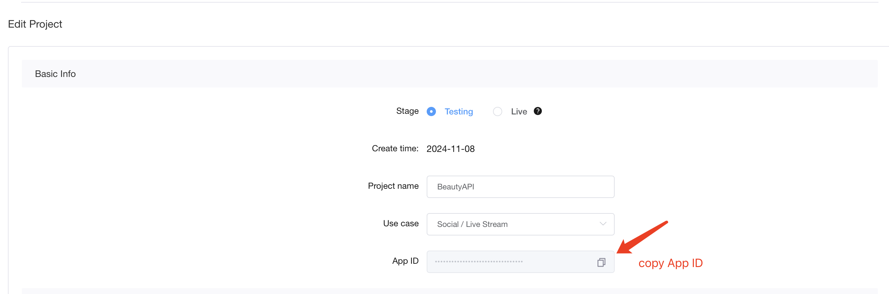

# BeautyAPI Demo

_English | [中文](README.zh.md)_

> This document mainly introduces how to quickly run through the beauty scene API sample code.
> 
> **Demo Effect:**
>
> 
---

## 1. Prerequisites

- Android 5.0（SDK API Level 21）Above
- Android Studio 3.5+, Using java 11
- Android 5.0 and above mobile devices.

---

## 2. Run Project

- Get Agora App ID -------- [get-started-with-agora](https://docs.agora.io/en/video-calling/get-started/manage-agora-account?platform=Android#get-the-app-id)
   - Go to [Console](https://console.agora.io)
   
   - Click 'Create a project'
    
      
   
   - Select Debug Mode and Create (This example only supports Debug Mode)
   
      
   
   - Copy App ID
      
      

- Create local.properties file in android root direction, and fill in the agora app id to the file:

   ```xml
   AGORA_APP_ID=#YOUR APP ID#
   ```

- **Contact the beauty manufacturer to obtain the corresponding beauty certificate and resources, and make the following configurations** (If the beautification certificate and resources are not configured, the corresponding manufacturer’s beautification will display a black screen.)
  
<h3 id="1">SenseTime(Optional)</h3>

- Configure the package name *applicationId* corresponding to the certificate in [app/build.gradle](app/build.gradle)

-  Unzip the SenseTime Beauty SDK and copy the following files/directories to the corresponding path
      
   | SenseTime Beauty SDK                                                 | Location                                                 |
   |----------------------------------------------------------------------|----------------------------------------------------------|
   | Android/models                                                       | app/src/main/assets/beauty_sensetime/models              |
   | Android/smaple/SenseMeEffects/app/src/main/assets/sticker_face_shape | app/src/main/assets/beauty_sensetime/sticker_face_shape  |
   | Android/smaple/SenseMeEffects/app/src/main/assets/style_lightly      | app/src/main/assets/beauty_sensetime/style_lightly       |
   | Android/smaple/SenseMeEffects/app/src/main/assets/makeup_lip         | app/src/main/assets/beauty_sensetime/makeup_lip          |
   | SenseME.lic                                                          | app/src/main/assets/beauty_sensetime/license/SenseME.lic |

<h3 id="2">FaceUnity(Optional)</h3>

- Configure the package name applicationId corresponding to the certificate in [app/build.gradle](app/build.gradle)
       
- Put the FaceUnity beauty resources into the corresponding path

   | FaceUnity Beauty Resources          | Location                                                                  |
   |-------------------------------------|---------------------------------------------------------------------------|
   | makeup resource(e.g. naicha.bundle) | app/src/main/assets/beauty_faceunity/makeup                               |
   | sticker resource(e.g. fashi.bundle) | app/src/main/assets/beauty_faceunity/sticker                              |
   | authpack.java                       | app/src/main/java/io/agora/beautyapi/demo/module/faceunity/authpack.java  |
  
<h3 id="3">ByteDance(Optional)</h3>

- Configure the package name applicationId corresponding to the certificate in [app/build.gradle](app/build.gradle)

- Modify the LICENSE_NAME in the [ByteDanceBeautySDK.kt](app/src/main/java/io/agora/beautyapi/demo/module/bytedance/ByteDanceBeautySDK.kt file to the name of the applied certificate file).

- Unzip the ByteDance beauty resource and copy the following files/directories to the corresponding path

   | ByteDance Beauty Resources      | Location                             |
   |---------------------------------|--------------------------------------|
   | resource/LicenseBag.bundle      | app/src/main/assets/beauty_bytedance |
   | resource/ModelResource.bundle   | app/src/main/assets/beauty_bytedance |
   | resource/ComposeMakeup.bundle   | app/src/main/assets/beauty_bytedance |
   | resource/StickerResource.bundle | app/src/main/assets/beauty_bytedance |
   | resource/StickerResource.bundle | app/src/main/assets/beauty_bytedance |
  
<h3 id="4">Cosmos(Optional)</h3>

- Configure the package name applicationId corresponding to the certificate in [app/build.gradle](app/build.gradle)

- Unzip the Cosmos beauty resource and copy the following files/directories to the corresponding path
      
   | Cosmos Beauty Resources                | Location                                         |
   |-------------------------------------------|--------------------------------------------------|
   | sample/app/src/main/assets/model-all.zip  | app/src/main/assets/beauty_cosmos/model-all.zip  |
   | sample/app/src/main/assets/cosmos.zip     | app/src/main/assets/beauty_cosmos/cosmos.zip     |


**Run**
- Use AndroidStudio to open the `Android` project and click Run.

--

## 3. Quick integration

- Each beauty api can be integrated into your project separately     
                                                                  

## SenseTime

### Configure beauty
- Ensure you have contacted SenseTime technical support to obtain the latest Beauty SDK, resources, and certificates.
- Configure beauty certificates and resources. -- [Configure](#1)
- Integrate the Agora Beauty Scene API into your project. Add the files from the directory [sensetime](/Android/lib_sensetime/src/main/java/io/agora/beautyapi/sensetime/) to your project, including the following:
  
   * [utils](/Android/lib_sensetime/src/main/java/io/agora/beautyapi/sensetime/utils/)
	* [SenseTimeBeautyAPI.kt](/Android/lib_sensetime/src/main/java/io/agora/beautyapi/sensetime/SenseTimeBeautyAPI.kt)
	* [SenseTimeBeautyAPIImpl.kt](/Android/lib_sensetime/src/main/java/io/agora/beautyapi/sensetime/SenseTimeBeautyAPIImpl.kt)
  
*Note:*

      To facilitate future code upgrades, please avoid modifying the names and paths of these files you have added.

### Implement beauty effects.

#### 1. Initialize the RtcEngine.
```kotlin
private val mRtcEngine by lazy {
    RtcEngine.create(RtcEngineConfig().apply {
        mContext = applicationContext
        // Enter the APP ID of your Agora project obtained from the console.
        mAppId = BuildConfig.AGORA_APP_ID
        mEventHandler = object : IRtcEngineEventHandler() {}
    })
}
```

#### 2.Initialize the beauty SDK.

- Check license
   ```kotlin
   private fun checkLicense(context: Context): Boolean {
      val license = FileUtils.getAssetsString(context,"$resourcePath/license/SenseME.lic")
      if (TextUtils.isEmpty(license)) {
         return false
      }
      val activeCode = STMobileAuthentificationNative.generateActiveCodeFromBuffer(context,license,license.length)
      Log.d(TAG, "SenseTime >> checkLicense activeCode=$activeCode")
      return activeCode.isNotEmpty()
   }
   ``` 

- Initialize effect handler   
   ```kotlin
   private fun initMobileEffect(context: Context) {
      if (_mobileEffectNative != null) {
         return
      }
      _mobileEffectNative = STMobileEffectNative()
      val result = _mobileEffectNative?.createInstance(context, STMobileEffectNative.EFFECT_CONFIG_NONE)
      _mobileEffectNative?.setParam(STMobileEffectParams.EFFECT_PARAM_QUATERNION_SMOOTH_FRAME, 5f)
      Log.d(TAG, "SenseTime >> STMobileEffectNative create result : $result")
   }
   ``` 

 - Initialize face recognition handler   
   ```kotlin
   private fun initHumanAction(context: Context) {
      if (_humanActionNative != null) {
         return
      }
      _humanActionNative = STMobileHumanActionNative()
      val result = _humanActionNative?.createInstanceFromAssetFile("$resourcePath/$MODEL_106", humanActionCreateConfig, context.assets)
      Log.d(TAG, "SenseTime >> STMobileHumanActionNative create result : $result")
   }
   ``` 

#### 3.Initialize the Beauty API.

- Call **createSenseTimeBeautyAPI** to create a Beauty API object. The Beauty API object is encapsulated based on STMobileEffectNative and STMobileHumanActionNative objects.
```kotlin
private val mSenseTimeApi by lazy {
    createSenseTimeBeautyAPI()
}

mSenseTimeApi.initialize(
    Config(
        // Android context
        context = mContext,
        
        // Agora RTC engine
        rtcEngine = mRtcEngine,
        
        // Beauty SDK handler
        stHandlers = STHandlers(mobileEffectNative, humanActionNative),
        
        // Agora: Use the internal raw data interface of Agora for processing.
        // Custom: you need to call the [io.agora.rtc2.video.IVideoFrameObserver] interface yourself 
        // to pass the raw video frame to the BeautyAPI for processing.
        captureMode = if (isCustomCaptureMode) CaptureMode.Custom else CaptureMode.Agora,
        
        // Stats interval duration
        statsDuration = 1000,
        
        // Enable stats or not
        statsEnable = true,
        
        // Camera mirror configuration
        cameraConfig = CameraConfig(),
        
        // Event callback
        eventCallback = object : IEventCallback {
            override fun onBeautyStats(stats: BeautyStats) {
                Log.d(TAG, "BeautyStats stats = $stats")
            }
        }
    )
)
```

#### 4. Enable Beauty Mode

- Call the enable method of the Beauty API and set the parameter to true to activate beauty mode.
```kotlin
mSenseTimeApi.enable(true)
```

#### 5.	Start Video Capture

- Developers can use the Agora module for video capture or customize the video capture process. This section explains how to start video capture in both scenarios.

**Using the Agora module for video capture**
```kotlin
// Enable video module
mRtcEngine.enableVideo()

// Set up the local view
mSenseTimeApi.setupLocalVideo(
    mBinding.localVideoView,
    Constants.RENDER_MODE_FIT
)
```

**Custom Video Capture**
```kotlin
// Enable video module
mRtcEngine.enableVideo()

// Register the raw video data observer
// When custom video capture is enabled, that is, when CaptureMode is Custom, 
// you need to register the raw video observer
mRtcEngine.registerVideoFrameObserver(object : IVideoFrameObserver {
    private var shouldMirror = true

    override fun onCaptureVideoFrame(sourceType: Int, videoFrame: VideoFrame?): Boolean {
        when (mSenseTimeApi.onFrame(videoFrame!!)) {
            // When the processing result is SKIPPED, it means frame dropping, 
            // i.e., the externally captured video data is not passed to the Agora RTC SDK
            // For other processing results, the externally captured video data is passed to the Agora RTC SDK
            ErrorCode.ERROR_OK.value -> {
                shouldMirror = false
                return true
            }
            ErrorCode.ERROR_FRAME_SKIPPED.value -> {
                shouldMirror = false
                return false
            }
            else -> {
                val mirror = videoFrame.sourceType == VideoFrame.SourceType.kFrontCamera
                if (shouldMirror != mirror) {
                    shouldMirror = mirror
                    return false
                }
                return true
            }
        }
    }

    // Set whether to mirror the original video data
    override fun getMirrorApplied() = shouldMirror

    // Set the observation point to the video data during local capture
    override fun getObservedFramePosition() = IVideoFrameObserver.POSITION_POST_CAPTURER

    // Override other callback functions in the video observer
    ...
})
```

#### 6.Join Channel

```kotlin
mRtcEngine.joinChannel(
    null, 
    mChannelName, 
    0, 
    ChannelMediaOptions().apply {
        // Set channel profile as live broadcasting
        channelProfile = Constants.CHANNEL_PROFILE_LIVE_BROADCASTING
        
        // Set user role as broadcaster, who can publish and subscribe to streams in the channel
        clientRoleType = Constants.CLIENT_ROLE_BROADCASTER
        
        // Set whether to publish camera video stream (applies when using Agora's video capture)
        publishCameraTrack = true
        
        // Set whether to publish custom video stream (applies when using custom video capture)
        publishCustomVideoTrack = false
        
        // Set whether to publish microphone audio stream
        publishMicrophoneTrack = false
        
        // Set whether to automatically subscribe to other users' audio streams when joining the channel
        autoSubscribeAudio = false
        
        // Set whether to automatically subscribe to other users' video streams when joining the channel
        autoSubscribeVideo = true
    }
)
```

#### 7. Update Camera Configuration(Optional)

```kotlin
val isFront = mSenseTimeApi.isFrontCamera()

// Check if front camera is being used
if (isFront) {
    cameraConfig = CameraConfig(
        // Configure front camera through frontMirror
        frontMirror = when (cameraConfig.frontMirror) {
            MirrorMode.MIRROR_LOCAL_REMOTE -> MirrorMode.MIRROR_LOCAL_ONLY
            MirrorMode.MIRROR_LOCAL_ONLY -> MirrorMode.MIRROR_REMOTE_ONLY
            MirrorMode.MIRROR_REMOTE_ONLY -> MirrorMode.MIRROR_NONE
            MirrorMode.MIRROR_NONE -> MirrorMode.MIRROR_LOCAL_REMOTE
        },
        backMirror = cameraConfig.backMirror
    )
} else {
    cameraConfig = CameraConfig(
        frontMirror = cameraConfig.frontMirror,
        // Configure rear camera through backMirror
        backMirror = when (cameraConfig.backMirror) {
            MirrorMode.MIRROR_NONE -> MirrorMode.MIRROR_LOCAL_REMOTE
            MirrorMode.MIRROR_LOCAL_REMOTE -> MirrorMode.MIRROR_LOCAL_ONLY
            MirrorMode.MIRROR_LOCAL_ONLY -> MirrorMode.MIRROR_REMOTE_ONLY
            MirrorMode.MIRROR_REMOTE_ONLY -> MirrorMode.MIRROR_NONE
        }
    )
}

// Update camera configuration
mSenseTimeApi.updateCameraConfig(cameraConfig)
```

#### 8. Leave channel

```kotlin
mRtcEngine.leaveChannel()
```

#### 9. Destroy Resources

- Call release on the Beauty API to destroy the Beauty API.

```kotlin
mSenseTimeApi.release()
```

- Call release on the Beauty SDK to destroy STHandlers.

```kotlin
private fun unInitMobileEffect() {
    _mobileEffectNative?.destroyInstance()
    _mobileEffectNative = null
}
private fun unInitHumanActionNative() {
    _humanActionNative?.destroyInstance()
    _humanActionNative = null
}

```

- Call destroy on RtcEngine to destroy RtcEngine.

```kotlin
RtcEngine.destroy()
```

## FaceUnity

### Configure beauty
- Ensure you have contacted FaceUnity technical support to obtain the latest Beauty SDK, resources, and certificates.
- Configure beauty certificates and resources. -- [Configure](#1)
- Integrate the Agora Beauty Scene API into your project. Add the files from the directory [faceunity](/Android/lib_faceunity/src/main/java/io/agora/beautyapi/faceunity/) to your project, including the following:
  
   * [utils](/Android/lib_faceunity/src/main/java/io/agora/beautyapi/faceunity/utils/)
	* [FaceUnityBeautyAPI.kt](/Android/lib_faceunity/src/main/java/io/agora/beautyapi/faceunity/FaceUnityBeautyAPI.kt)
	* [FaceUnityBeautyAPIImpl.kt](/Android/lib_faceunity/src/main/java/io/agora/beautyapi/faceunity/FaceUnityBeautyAPIImpl.kt)

*Note:*

      To facilitate future code upgrades, please avoid modifying the names and paths of these files you have added.

### Implement beauty effects.

#### 1. Initialize the RtcEngine.
```kotlin
private val mRtcEngine by lazy {
    RtcEngine.create(RtcEngineConfig().apply {
        mContext = applicationContext
        // Enter the APP ID of your Agora project obtained from the console.
        mAppId = BuildConfig.AGORA_APP_ID
        mEventHandler = object : IRtcEngineEventHandler() {}
    })
}
```

#### 2.Initialize the beauty SDK.

- Initialize the FURenderKit object by calling the registerFURender method from the FaceUnity beauty SDK, passing in the following parameters:
	- context: Android Context.
	- getAuth(): A ByteArray returned by the getAuth method, containing the authentication field. This authentication field is linked to the local authpack.java certificate file, and successful validation is required to use the FaceUnity beauty SDK.
	- object: Event callback.

- Once the beauty SDK is initialized successfully, load AI props on a new thread by calling loadAIProcessor.
```kotlin
object FaceUnityBeautySDK {
    private val TAG = "FaceUnityBeautySDK"

    private val fuAIKit = FUAIKit.getInstance()
    val fuRenderKit = FURenderKit.getInstance()

    // AI props
    private val BUNDLE_AI_FACE = "model" + File.separator + "ai_face_processor.bundle"
    private val BUNDLE_AI_HUMAN = "model" + File.separator + "ai_human_processor.bundle"

    private val workerThread = Executors.newSingleThreadExecutor()

    fun initBeauty(context: Context) {
        // Set beauty SDK logging
        FURenderManager.setKitDebug(FULogger.LogLevel.TRACE)
        FURenderManager.setCoreDebug(FULogger.LogLevel.ERROR)
        
        // Initialize beauty SDK
        // Need to pass beauty SDK authentication field and set beauty SDK event listener
        FURenderManager.registerFURender(context, getAuth(), object : OperateCallback {
            override fun onSuccess(code: Int, msg: String) {
                Log.i(TAG, "FURenderManager onSuccess -- code=$code, msg=$msg")
                if (code == OPERATE_SUCCESS_AUTH) {
                    faceunity.fuSetUseTexAsync(1)
                    // If beauty SDK initialization is successful, load AI props in new thread
                    workerThread.submit {
                        fuAIKit.loadAIProcessor(BUNDLE_AI_FACE, FUAITypeEnum.FUAITYPE_FACEPROCESSOR)
                        fuAIKit.loadAIProcessor(BUNDLE_AI_HUMAN, FUAITypeEnum.FUAITYPE_HUMAN_PROCESSOR)
                    }
                }
            }

            override fun onFail(errCode: Int, errMsg: String) {
                Log.e(TAG, "FURenderManager onFail -- code=$errCode, msg=$errMsg")
            }
        })
    }

    // Get beauty SDK authentication field
    private fun getAuth(): ByteArray {
        val authpack = Class.forName("io.agora.beautyapi.demo.authpack")
        val aMethod = authpack.getDeclaredMethod("A")
        aMethod.isAccessible = true
        val authValue = aMethod.invoke(null) as? ByteArray
        return authValue ?: ByteArray(0)
    }
}
```

#### 3.Initialize the Beauty API.

- Call **createFaceUnityBeautyAPI** to create a Beauty API object. The Beauty API object is encapsulated based on FuRenderKit objects.
```kotlin
private val mFaceUnityApi by lazy {
    createFaceUnityBeautyAPI()
}

mFaceUnityApi.initialize(
    Config(
        // Android context
        context = mContext,
        
        // Agora RTC engine
        rtcEngine = mRtcEngine,
        
        // Beauty SDK handler
        fuRenderKit = FURenderKit.getInstance(),
        
        // Agora: Use the internal raw data interface of Agora for processing.
        // Custom: you need to call the [io.agora.rtc2.video.IVideoFrameObserver] interface yourself 
        // to pass the raw video frame to the BeautyAPI for processing.
        captureMode = if(isCustomCaptureMode) CaptureMode.Custom else CaptureMode.Agora,

        // Stats interval duration
        statsDuration = 1000,
        
        // Enable stats or not
        statsEnable = true,
        
        // Camera mirror configuration
        cameraConfig = CameraConfig(),

        // Event callback
        eventCallback = object : IEventCallback {
            override fun onBeautyStats(stats: BeautyStats) {
                Log.d(TAG, "BeautyStats stats = $stats")
            }
        }
    )
)

```

#### 4. Enable Beauty Mode

- Call the enable method of the Beauty API and set the parameter to true to activate beauty mode.
```kotlin
mFaceUnityApi.enable(true)
```

#### 5.	Start Video Capture

- Developers can use the Agora module for video capture or customize the video capture process. This section explains how to start video capture in both scenarios.

**Using the Agora module for video capture**
```kotlin
// Enable video module
mRtcEngine.enableVideo()

// Set up the local view
mFaceUnityApi.setupLocalVideo(
    mBinding.localVideoView,
    Constants.RENDER_MODE_FIT
)
```

**Custom Video Capture**
```kotlin
// Enable video module
mRtcEngine.enableVideo()
// Register the raw video data observer
// When custom video capture is enabled, that is, when CaptureMode is Custom, 
// you need to register the raw video observer
mRtcEngine.registerVideoFrameObserver(object : IVideoFrameObserver {

    override fun onCaptureVideoFrame(
        sourceType: Int,
        videoFrame: VideoFrame?
    ) = when (mFaceUnityApi.onFrame(videoFrame!!)) {
       // When the processing result is SKIPPED, it means frame dropping, 
        // i.e., the externally captured video data is not passed to the Agora RTC SDK
        // For other processing results, the externally captured video data is passed to the Agora RTC SDK
        ErrorCode.ERROR_FRAME_SKIPPED.value -> false
        else -> true
    }

    // Set whether to mirror the original video data
    override fun getMirrorApplied() = mFaceUnityApi.getMirrorApplied()

    // Set the observation point to the video data during local capture
    override fun getObservedFramePosition() = IVideoFrameObserver.POSITION_POST_CAPTURER

    // Override other callback functions in the video observer
    ...
})
```

#### 6.Join Channel

```kotlin
mRtcEngine.joinChannel(
    null, 
    mChannelName, 
    0, 
    ChannelMediaOptions().apply {
        // Set channel profile as live broadcasting
        channelProfile = Constants.CHANNEL_PROFILE_LIVE_BROADCASTING
        
        // Set user role as broadcaster, who can publish and subscribe to streams in the channel
        clientRoleType = Constants.CLIENT_ROLE_BROADCASTER
        
        // Set whether to publish camera video stream (applies when using Agora's video capture)
        publishCameraTrack = true
        
        // Set whether to publish custom video stream (applies when using custom video capture)
        publishCustomVideoTrack = false
        
        // Set whether to publish microphone audio stream
        publishMicrophoneTrack = false
        
        // Set whether to automatically subscribe to other users' audio streams when joining the channel
        autoSubscribeAudio = false
        
        // Set whether to automatically subscribe to other users' video streams when joining the channel
        autoSubscribeVideo = true
    }
)
```

#### 7. Update Camera Configuration(Optional)

```kotlin
val isFront = mSenseTimeApi.isFrontCamera()

// Check if front camera is being used
if (isFront) {
    cameraConfig = CameraConfig(
        // Configure front camera through frontMirror
        frontMirror = when (cameraConfig.frontMirror) {
            MirrorMode.MIRROR_LOCAL_REMOTE -> MirrorMode.MIRROR_LOCAL_ONLY
            MirrorMode.MIRROR_LOCAL_ONLY -> MirrorMode.MIRROR_REMOTE_ONLY
            MirrorMode.MIRROR_REMOTE_ONLY -> MirrorMode.MIRROR_NONE
            MirrorMode.MIRROR_NONE -> MirrorMode.MIRROR_LOCAL_REMOTE
        },
        backMirror = cameraConfig.backMirror
    )
} else {
    cameraConfig = CameraConfig(
        frontMirror = cameraConfig.frontMirror,
        // Configure rear camera through backMirror
        backMirror = when (cameraConfig.backMirror) {
            MirrorMode.MIRROR_NONE -> MirrorMode.MIRROR_LOCAL_REMOTE
            MirrorMode.MIRROR_LOCAL_REMOTE -> MirrorMode.MIRROR_LOCAL_ONLY
            MirrorMode.MIRROR_LOCAL_ONLY -> MirrorMode.MIRROR_REMOTE_ONLY
            MirrorMode.MIRROR_REMOTE_ONLY -> MirrorMode.MIRROR_NONE
        }
    )
}

// Update camera configuration
mFaceUnityApi.updateCameraConfig(cameraConfig)
```

#### 8. Leave channel

```kotlin
mRtcEngine.leaveChannel()
```

#### 9. Destroy Resources

- Call release on the Beauty API to destroy the Beauty API.

```kotlin
mFaceUnityApi.release()
```

- Call release on the Beauty SDK to destroy STHandlers.

```kotlin
FURenderKit.getInstance().release()
```

- Call destroy on RtcEngine to destroy RtcEngine.

```kotlin
RtcEngine.destroy()
```

## ByteDance

### Configure beauty
- Ensure you have contacted ByteDance technical support to obtain the latest Beauty SDK, resources, and certificates.
- Configure beauty certificates and resources. -- [Configure](#3)
- Integrate the Agora Beauty Scene API into your project. Add the files from the directory [bytedance](/Android/lib_bytedance/src/main/java/io/agora/beautyapi/bytedance/) to your project, including the following:
  
   * [utils](/Android/lib_bytedance/src/main/java/io/agora/beautyapi/bytedance/utils/)
	* [ByteDanceBeautyAPI.kt](/Android/lib_bytedance/src/main/java/io/agora/beautyapi/bytedance/ByteDanceBeautyAPI.kt)
	* [ByteDanceBeautyAPIImpl.kt](/Android/lib_bytedance/src/main/java/io/agora/beautyapi/bytedance/ByteDanceBeautyAPIImpl.kt)

*Note:*

      To facilitate future code upgrades, please avoid modifying the names and paths of these files you have added.

### Implement beauty effects.

#### 1. Initialize the RtcEngine.
```kotlin
private val mRtcEngine by lazy {
    RtcEngine.create(RtcEngineConfig().apply {
        mContext = applicationContext
        // Enter the APP ID of your Agora project obtained from the console.
        mAppId = BuildConfig.AGORA_APP_ID
        mEventHandler = object : IRtcEngineEventHandler() {}
    })
}
```

#### 2. Initialize the RenderManager

- Copy the beauty certificate and beauty resources to the SD card storage.
```kotlin
fun initBeautySDK(context: Context){
    val storagePath = context.getExternalFilesDir("")?.absolutePath ?: return
    val assetsPath = "beauty_bytedance"

    workerThread.execute {
        // copy license
        licensePath = "$storagePath/beauty_bytedance/LicenseBag.bundle/$LICENSE_NAME"
        FileUtils.copyAssets(context, "$assetsPath/LicenseBag.bundle/$LICENSE_NAME", licensePath)

        // copy models
        modelsPath = "$storagePath/beauty_bytedance/ModelResource.bundle"
        FileUtils.copyAssets(context, "$assetsPath/ModelResource.bundle", modelsPath)

        // copy beauty node
        beautyNodePath = "$storagePath/beauty_bytedance/ComposeMakeup.bundle/ComposeMakeup/beauty_Android_lite"
        FileUtils.copyAssets(context, "$assetsPath/ComposeMakeup.bundle/ComposeMakeup/beauty_Android_lite", beautyNodePath)

        // copy beauty 4items node
        beauty4ItemsNodePath = "$storagePath/beauty_bytedance/ComposeMakeup.bundle/ComposeMakeup/beauty_4Items"
        FileUtils.copyAssets(context, "$assetsPath/ComposeMakeup.bundle/ComposeMakeup/beauty_4Items", beauty4ItemsNodePath)

        // copy resharp node
        reSharpNodePath = "$storagePath/beauty_bytedance/ComposeMakeup.bundle/ComposeMakeup/reshape_lite"
        FileUtils.copyAssets(context, "$assetsPath/ComposeMakeup.bundle/ComposeMakeup/reshape_lite", reSharpNodePath)

        // copy makeup node
        makeupTianmeiNodePath = "$storagePath/beauty_bytedance/ComposeMakeup.bundle/ComposeMakeup/style_makeup/tianmei"
        FileUtils.copyAssets(context, "$assetsPath/ComposeMakeup.bundle/ComposeMakeup/style_makeup/tianmei", makeupTianmeiNodePath)

        // copy stickers
        stickerPath = "$storagePath/beauty_bytedance/StickerResource.bundle/stickers"
        FileUtils.copyAssets(context, "$assetsPath/StickerResource.bundle/stickers", stickerPath)
    }
}

```

- Initialize the RenderManager instance by calling the initEffect method of the Beauty SDK within the GL thread (Graphics Library Thread).
```kotlin
// GL Thread
// Initialize the RenderManager instance within the Beauty SDK.
fun initEffect(context: Context){
    val ret = renderManager.init(
        context,
        modelsPath, licensePath, false, false, 0
    )
    if(!checkResult("RenderManager init ", ret)){
        return
    }
    renderManager.useBuiltinSensor(true)
    renderManager.set3Buffer(false)
    renderManager.appendComposerNodes(arrayOf(beautyNodePath, beauty4ItemsNodePath, reSharpNodePath))
    renderManager.loadResourceWithTimeout(-1)
}

```

#### 3.Initialize the Beauty API.

- Call **createByteDanceBeautyAPI** to create a Beauty API object. The Beauty API object is encapsulated based on FuRenderKit objects.
```kotlin
private val mByteDanceApi by lazy {
    createByteDanceBeautyAPI()
}

mByteDanceApi.initialize(
    Config(
        // Android context
        context = mContext,
        
        // Agora RTC engine
        rtcEngine = mRtcEngine,
        
        // Beauty SDK handler
        renderManager = renderManager,
        
        // Agora: Use the internal raw data interface of Agora for processing.
        // Custom: you need to call the [io.agora.rtc2.video.IVideoFrameObserver] interface yourself 
        // to pass the raw video frame to the BeautyAPI for processing.
        captureMode = if(isCustomCaptureMode) CaptureMode.Custom else CaptureMode.Agora,

        // Stats interval duration
        statsDuration = 1000,
        
        // Enable stats or not
        statsEnable = true,
        
        // Camera mirror configuration
        cameraConfig = CameraConfig(),

        // Event callback
        eventCallback = EventCallback(
            onBeautyStats = { stats ->
                Log.d(TAG, "BeautyStats stats = $stats")
            },
            onEffectInitialized = {
               // Callback after effectManager initialization is completed in the GL thread.
                ByteDanceBeautySDK.initEffect(ctx)
            },
            onEffectDestroyed = {
               // Callback after effectManager destruction is completed in the GL thread.
                ByteDanceBeautySDK.unInitEffect()
            }
        )
    )
)

```

#### 4. Enable Beauty Mode

- Call the enable method of the Beauty API and set the parameter to true to activate beauty mode.
```kotlin
mByteDanceApi.enable(true)
```

#### 5.	Start Video Capture

- Developers can use the Agora module for video capture or customize the video capture process. This section explains how to start video capture in both scenarios.

**Using the Agora module for video capture**
```kotlin
// Enable video module
mRtcEngine.enableVideo()

// Set up the local view
mFaceUnityApi.setupLocalVideo(
    mBinding.localVideoView,
    Constants.RENDER_MODE_FIT
)
```

**Custom Video Capture**
```kotlin
// Enable video module
mRtcEngine.enableVideo()
// Register the raw video data observer
// When custom video capture is enabled, that is, when CaptureMode is Custom, 
// you need to register the raw video observer
mRtcEngine.registerVideoFrameObserver(object : IVideoFrameObserver {

    override fun onCaptureVideoFrame(
        sourceType: Int,
        videoFrame: VideoFrame?
    ) = when (mFaceUnityApi.onFrame(videoFrame!!)) {
       // When the processing result is SKIPPED, it means frame dropping, 
        // i.e., the externally captured video data is not passed to the Agora RTC SDK
        // For other processing results, the externally captured video data is passed to the Agora RTC SDK
        ErrorCode.ERROR_FRAME_SKIPPED.value -> false
        else -> true
    }

    // Set whether to mirror the original video data
    override fun getMirrorApplied() = mByteDanceApi.getMirrorApplied()

    // Set the observation point to the video data during local capture
    override fun getObservedFramePosition() = IVideoFrameObserver.POSITION_POST_CAPTURER

    // Override other callback functions in the video observer
    ...
})
```

#### 6.Join Channel

```kotlin
mRtcEngine.joinChannel(
    null, 
    mChannelName, 
    0, 
    ChannelMediaOptions().apply {
        // Set channel profile as live broadcasting
        channelProfile = Constants.CHANNEL_PROFILE_LIVE_BROADCASTING
        
        // Set user role as broadcaster, who can publish and subscribe to streams in the channel
        clientRoleType = Constants.CLIENT_ROLE_BROADCASTER
        
        // Set whether to publish camera video stream (applies when using Agora's video capture)
        publishCameraTrack = true
        
        // Set whether to publish custom video stream (applies when using custom video capture)
        publishCustomVideoTrack = false
        
        // Set whether to publish microphone audio stream
        publishMicrophoneTrack = false
        
        // Set whether to automatically subscribe to other users' audio streams when joining the channel
        autoSubscribeAudio = false
        
        // Set whether to automatically subscribe to other users' video streams when joining the channel
        autoSubscribeVideo = true
    }
)
```

#### 7. Update Camera Configuration(Optional)

```kotlin
val isFront = mSenseTimeApi.isFrontCamera()

// Check if front camera is being used
if (isFront) {
    cameraConfig = CameraConfig(
        // Configure front camera through frontMirror
        frontMirror = when (cameraConfig.frontMirror) {
            MirrorMode.MIRROR_LOCAL_REMOTE -> MirrorMode.MIRROR_LOCAL_ONLY
            MirrorMode.MIRROR_LOCAL_ONLY -> MirrorMode.MIRROR_REMOTE_ONLY
            MirrorMode.MIRROR_REMOTE_ONLY -> MirrorMode.MIRROR_NONE
            MirrorMode.MIRROR_NONE -> MirrorMode.MIRROR_LOCAL_REMOTE
        },
        backMirror = cameraConfig.backMirror
    )
} else {
    cameraConfig = CameraConfig(
        frontMirror = cameraConfig.frontMirror,
        // Configure rear camera through backMirror
        backMirror = when (cameraConfig.backMirror) {
            MirrorMode.MIRROR_NONE -> MirrorMode.MIRROR_LOCAL_REMOTE
            MirrorMode.MIRROR_LOCAL_REMOTE -> MirrorMode.MIRROR_LOCAL_ONLY
            MirrorMode.MIRROR_LOCAL_ONLY -> MirrorMode.MIRROR_REMOTE_ONLY
            MirrorMode.MIRROR_REMOTE_ONLY -> MirrorMode.MIRROR_NONE
        }
    )
}

// Update camera configuration
mByteDanceApi.updateCameraConfig(cameraConfig)
```

#### 8. Leave channel

```kotlin
mRtcEngine.leaveChannel()
```

#### 9. Destroy Resources

- Call release on the Beauty API to destroy the Beauty API.

```kotlin
mByteDanceApi.release()
```

- Call the unInitEffect method of the Beauty SDK in the GL thread to destroy the RenderManager.

```kotlin
fun unInitEffect(){
    renderManager.release()
}

```

- Call destroy on RtcEngine to destroy RtcEngine.

```kotlin
RtcEngine.destroy()
```


## Cosmos
   - Ensure you have contacted Cosmos technical team to obtain the latest Beauty SDK, resources, and certificates.
   - Configure beauty certificates and resources. -- [Configure](#4)
  
  [Reference](./lib_cosmos/README.md)


## 4. Contact us

> Plan 1: If you are already using Shengwang services or are in the process of docking, you can directly contact the docked sales or service.
>
> Plan 2: Send an email to [support@agora.io](mailto:support@agora.io) for consultation
>
> Plan 3: Scan the QR code to join our WeChat communication group to ask questions
>
> 
---

## 5. License

The sample projects are under the [MIT license](../LICENSE).

