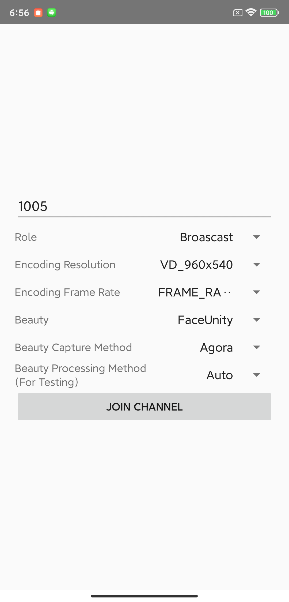

# BeautyAPI Demo

_English | [中文](README.zh.md)

> This document mainly introduces how to quickly run through the beauty scene API sample code.
> 
> **Demo Effect:**
>
> 
---

## 1. Prerequisites

- Android 5.0（SDK API Level 21）Above
- Android Studio 3.5+, Using java 11
- Android 5.0 and above mobile devices.

---

## 2. Run Project
- Get Agora App
   > - Create a developer account at [agora.io](https://www.agora.io/en/). Once you finish the signup process, you will be redirected to the Dashboard.
   >
   > - Navigate in the Dashboard tree on the left to Projects > Project List.
   > 
   > - Save the App Id from the Dashboard for later use.

- Create local.properties file in android root direction, and fill in the agora app id to the file:

```xml
AGORA_APP_ID=#YOUR APP ID#
```

- **Contact the beauty manufacturer to obtain the corresponding beauty certificate and resources, and make the following configurations**(If the beautification certificate and resources are not configured, the corresponding manufacturer’s beautification will display a black screen.)
   - **FaceUnity(Optional)**
      > - Configure the package name applicationId corresponding to the certificate in [app/build.gradle](app/build.gradle)
      > 
      > - Put the FaceUnity beauty resources into the corresponding path
      >
      > | FaceUnity Beauty Resources                         | Location                                                                    |
      > |----------------------------------------------------|-----------------------------------------------------------------------------|
      > | graphics resource(e.g. face_beautification.bundle) | app/src/main/assets/beauty_faceunity/graphics                               |
      > | makeup resource(e.g. diadiatu.bundle)              | app/src/main/assets/beauty_faceunity/makeup                                 |
      > | model resource(e.g. ai_face_processor.bundle)      | app/src/main/assets/beauty_faceunity/model                                  |
      > | sticker resource(e.g. sdlu.bundle)                 | app/src/main/assets/beauty_faceunity/sticker                                |
      > | authpack.java                                      | app/src/main/java/io/agora/beautyapi/demo/module/faceunity/authpack.java    |
- Run
   > - Use AndroidStudio to open the `Android` project and click Run.

---

## 3. Integrate Into Project

> Each beauty api can be integrated into your project separately, see the below integration documentation for details
> 
> | Beauty    | Documentation                                                                                                        |
> |----------------------------------------------------------------------------------------------------------------------| ------------------------------------------------------------ |
> | SenseTime | [Official website document](https://doc.shengwang.cn/doc/showroom/android/advanced-features/beauty/sensetime/integrate) |
> | FaceUnity | [Official website document](https://doc.shengwang.cn/doc/showroom/android/advanced-features/beauty/faceunity/integrate) |
> | ByteDance | [Official website document](https://doc.shengwang.cn/doc/showroom/android/advanced-features/beauty/bytedance/integrate) |
> | Cosmos    | [Cosmos beauty](./lib_cosmos/README.md)                                                                              |


### 4. License

The sample projects are under the [MIT license](../LICENSE).

