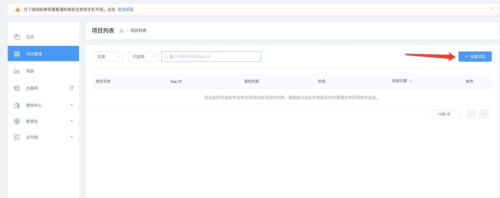
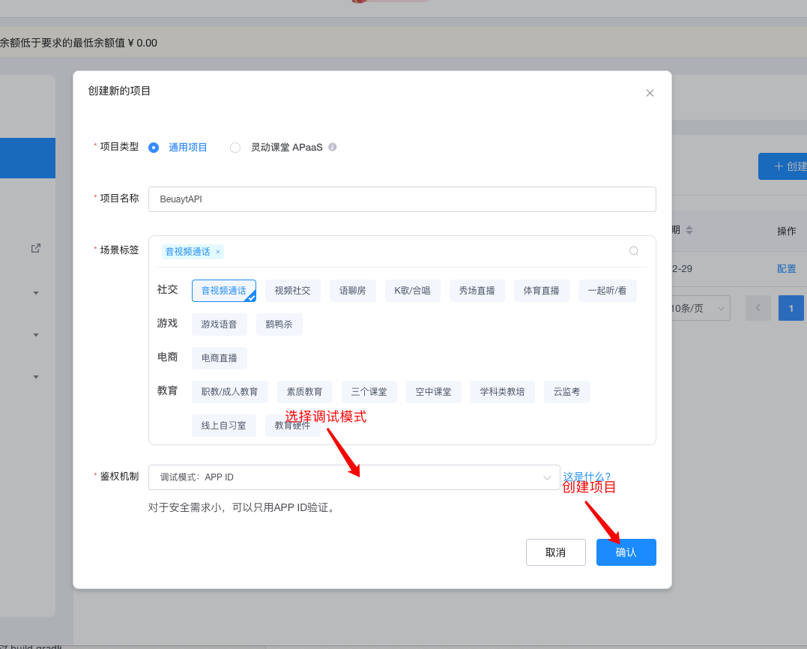
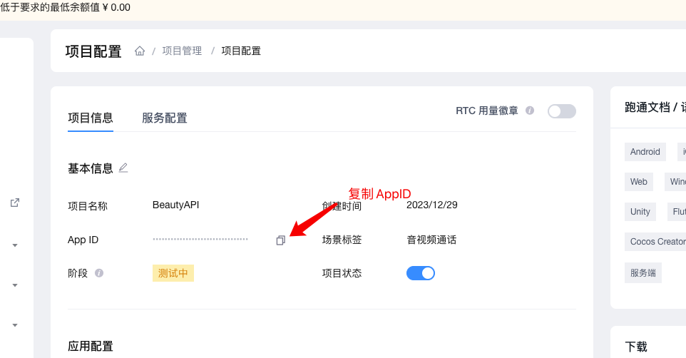

# 美颜场景化API Demo

[English](README.md) | 中文

> 本文档主要介绍如何快速跑通美颜场景化API示例代码。
> 
> **Demo 效果：**
>
> 
---


## 1. 环境准备

- 最低兼容 Android 5.0（SDK API Level 21）
- Android Studio 3.5及以上版本，使用Java 11
- Android 5.0 及以上的手机设备。

---

## 2. 运行示例
- 获取声网 App ID -------- [声网Agora - 文档中心 - 如何获取 App ID](https://docs.agora.io/cn/Agora%20Platform/get_appid_token?platform=All%20Platforms#%E8%8E%B7%E5%8F%96-app-id)
  > - 进入[控制台](https://console.shengwang.cn/)
  > 
  > - 点击创建应用
      > 
      > 
  >
  > - 选择调试模式并创建（本示例仅支持调试模式）
      >
      > 
  > 
  > - 复制 App ID
      >
      > 

- 在`Android`目录下创建`local.properties`，并在`Android/local.properties`里填写上面复制的声网 App ID

```xml
AGORA_APP_ID=<=声网 App ID=>
```

- **联系美颜厂家获取对应的美颜证书和资源，并做以下配置**（如果没有配置美颜证书和资源，对应厂家美颜会显示黑屏）
  - **相芯美颜（可选）**
    > - 在[app/build.gradle](app/build.gradle)里配置证书对应的包名applicationId
    >
    > - 将相芯美颜资源放入对应路径下
    >
    > | 美颜资源                                             | 项目路径                                                                     |
    > |----------------------------------------------------|-----------------------------------------------------------------------------|
    > | graphics resource(e.g. face_beautification.bundle) | app/src/main/assets/beauty_faceunity/graphics                               |
    > | makeup resource(e.g. naicha.bundle)                | app/src/main/assets/beauty_faceunity/makeup                                 |
    > | model resource(e.g. ai_face_processor.bundle)      | app/src/main/assets/beauty_faceunity/model                                  |
    > | sticker resource(e.g. fashi.bundle)                | app/src/main/assets/beauty_faceunity/sticker                                |
    > | authpack.java                                      | app/src/main/java/io/agora/beautyapi/demo/module/faceunity/authpack.java    |
- 运行项目
  > - 使用AndroidStudio打开`Android`项目，点击运行即可

---

## 3. 集成到项目

> 每个美颜可以单独集成到自己的项目，详见对应的集成说明文档
> 
> | 美颜     | 集成说明                                                                                               |
> |----------------------------------------------------------------------------------------------------| ------------------------------------------------------------ |
> | 商汤     | [官网文档](https://doc.shengwang.cn/doc/showroom/android/advanced-features/beauty/sensetime/integrate) |
> | 相芯     | [官网文档](https://doc.shengwang.cn/doc/showroom/android/advanced-features/beauty/faceunity/integrate) |
> | 字节火山 | [官网文档](https://doc.shengwang.cn/doc/showroom/android/advanced-features/beauty/bytedance/integrate) |
> | 宇宙     | [宇宙美颜](./lib_cosmos/README.zh.md)                                                                  |
---

## 4. 代码许可

The MIT [License (MIT)](../LICENSE)
