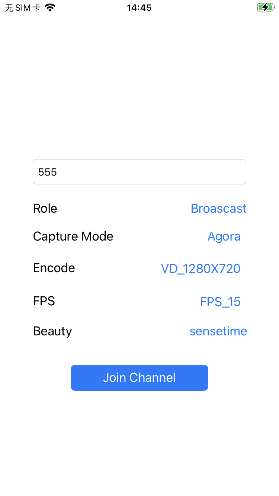

# Beauty API Demo

_English | [中文](README.zh.md)_

This document provides a comprehensive guide on how to quickly set up and run the Beauty API sample code.



---

## Prerequisites

- **iOS Version**: 11 and above
- **Xcode Version**: 13 and above

---

## Running the Project

### Step 1: Obtain Agora Credentials

1. **Create an Account**: Sign up at [agora.io](https://www.agora.io).
2. **Access Dashboard**: Navigate to Projects > Project List.
3. **Save App ID**: Copy your App ID for later use.

### Step 2: Set Up FaceUnity (Optional)

- **Contact Support**: Reach out to FaceUnity for the latest Beauty SDK, resources, and certificate.
- **Download Resources**: Extract and add the following files to your project:

| Resource Files | Project Path |
|----------------|--------------|
| [Model Files](https://github.com/Faceunity/FULiveDemo/tree/master/FURenderKit/Resources/model) | `iOS/FULib/Resources/model/*.bundle` |
| [Graphics Files](https://github.com/Faceunity/FULiveDemo/tree/master/FURenderKit/Resources/graphics) | `iOS/FULib/Resources/graphics/*.bundle` |
| Makeup Resources (e.g., naicha.bundle) | `iOS/FULib/Resources/makeup/*.bundle` |
| Sticker Resources (e.g., fashi.bundle) | `iOS/FULib/Resources/stickers/*.bundle` |
| `authpack.h` | `iOS/BeautyAPi/FUBeauty/authpack.h` |

### Step 3: Configure the Project

1. **Add Pod Dependency**: Update your Podfile with:
    ```ruby
    pod 'fuLib', :path => 'fu.podspec'
    ```

2. **Install Pods**: Run the following command:
    ```bash
    pod install
    ```

3. **Configure App ID**: Edit `KeyCenter.swift`:
    ```swift
    static let AppId: String = "YOUR_APP_ID"
    ```

4. **Update Bundle Identifier**: Change the `Bundle Identifier` in the BeautyAPI Project settings.

5. **Run the Project**: Launch the project in Xcode.

---

## Integrating BeautyAPI into Your Project

### Step 1: Add BeautyAPI Files

- **Include Files**: Add the `iOS/BeautyAPi/BeautyAPI` directory, `Render/FURender` folder, and `BeautyAPI.h` & `BeautyAPI.m` files to your project.

### Step 2: Install Dependencies

- **Update Podfile**: Modify your Podfile as follows:
    ```ruby
    platform :ios, '9.0'
    target 'Your_App_Name' do
        pod 'AgoraRtcEngine_iOS', 'x.y.z'
        pod 'fuLib', :path => 'fu.podspec'
    end
    ```

- **Install Pods**: Execute:
    ```bash
    pod install
    ```

### Step 3: Implement Beauty Features

1. **Initialize AgoraRtcEngineKit**:
    ```swift
    private lazy var rtcEngine: AgoraRtcEngineKit = {
        let config = AgoraRtcEngineConfig()
        config.appId = KeyCenter.AppId
        config.channelProfile = .liveBroadcasting
        let rtc = AgoraRtcEngineKit.sharedEngine(with: config, delegate: self)
        rtc.setClientRole(.broadcaster)
        rtc.enableAudio()
        rtc.enableVideo()
        rtc.setDefaultAudioRouteToSpeakerphone(true)
        return rtc
    }()
    ```

2. **Initialize Beauty API**:
    ```swift
    private lazy var fuRender = FUBeautyRender()
    private lazy var beautyAPI = BeautyAPI()

    let config = BeautyConfig()
    config.rtcEngine = rtcEngine
    config.captureMode = capture == "Custom" ? .custom : .agora
    config.cameraConfig = cameraConfig
    config.beautyRender = fuRender
    config.statsEnable = false
    config.statsDuration = 1
    config.eventCallback = { stats in
        print("Stats: min=\(stats.minCostMs), max=\(stats.maxCostMs), avg=\(stats.averageCostMs)")
    }

    let result = beautyAPI.initialize(config)
    if result != 0 {
        print("Initialization error: \(result)")
    }
    ```

3. **Enable Beauty Effects**:
    ```swift
    beautyAPI.enable(true)
    ```

4. **Start Video Capture**:
    ```swift
    beautyAPI.setupLocalVideo(localView, renderMode: .hidden)
    ```

5. **Custom Video Capture**:
   - Register a raw video data observer when using custom video capture:
    ```swift
    if capture == "Custom" {
        rtcEngine.setVideoFrameDelegate(self)
    }

    extension BeautyViewController: AgoraVideoFrameDelegate {
        func onCapture(_ videoFrame: AgoraOutputVideoFrame, sourceType: AgoraVideoSourceType) -> Bool {
            guard let pixelBuffer = videoFrame.pixelBuffer else { return true }
            beautyAPI.onFrame(pixelBuffer) { pixelBuffer in
                videoFrame.pixelBuffer = pixelBuffer
            }
            return true
        }

        func getMirrorApplied() -> Bool {
            beautyAPI.getMirrorApplied()
        }

        func getObservedFramePosition() -> AgoraVideoFramePosition {
            .postCapture
        }
    }
    ```

6. **Join a Channel**:
    ```swift
    let mediaOption = AgoraRtcChannelMediaOptions()
    mediaOption.clientRoleType = isBroadcast ? .broadcaster : .audience
    mediaOption.autoSubscribeAudio = true
    mediaOption.autoSubscribeVideo = true
    mediaOption.publishCameraTrack = mediaOption.clientRoleType == .broadcaster
    mediaOption.publishCustomVideoTrack = false
    mediaOption.publishMicrophoneTrack = mediaOption.clientRoleType == .broadcaster

    let result = rtcEngine.joinChannel(byToken: nil, channelId: channelName ?? "", uid: 0, mediaOptions: mediaOption)
    if result != 0 {
        print("Join channel failed")
    }
    ```

7. **Update Camera Configuration (Optional)**:
    ```swift
    beautyAPI.switchCamera()

    let cameraConfig = BeautyManager.shareManager.cameraConfig
    if self.beautyAPI?.isFrontCamera ?? false {
        cameraConfig.frontMirror = Configs.mirrorTypes[value] ?? .LOCAL_REMOTE
    } else {
        cameraConfig.backMirror = Configs.mirrorTypes[value] ?? .NONE
    }
    self.beautyAPI?.update(cameraConfig)
    ```

8. **Leave the Channel**:
    ```swift
    rtcEngine.leaveChannel()
    ```

9. **Destroy Resources**:
    ```swift
    beautyAPI.destroy()
    AgoraRtcEngineKit.destroy()
    ```

---

## Contact Us

- **Existing Users**: Contact your assigned sales or service representative.
- **Email Support**: [support@agora.io](mailto:support@agora.io)
- **WeChat Group**: Scan the QR code to join our community.


---

## License

This project is licensed under the [MIT License](../LICENSE).
