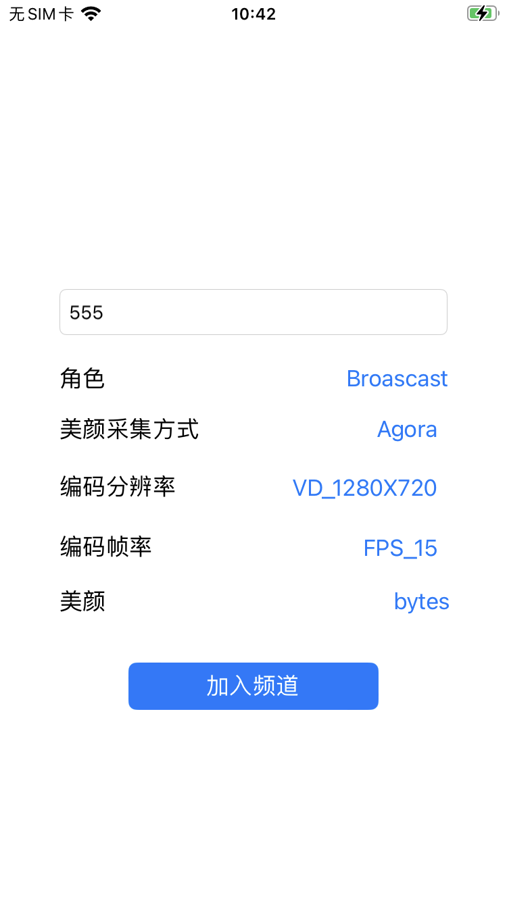
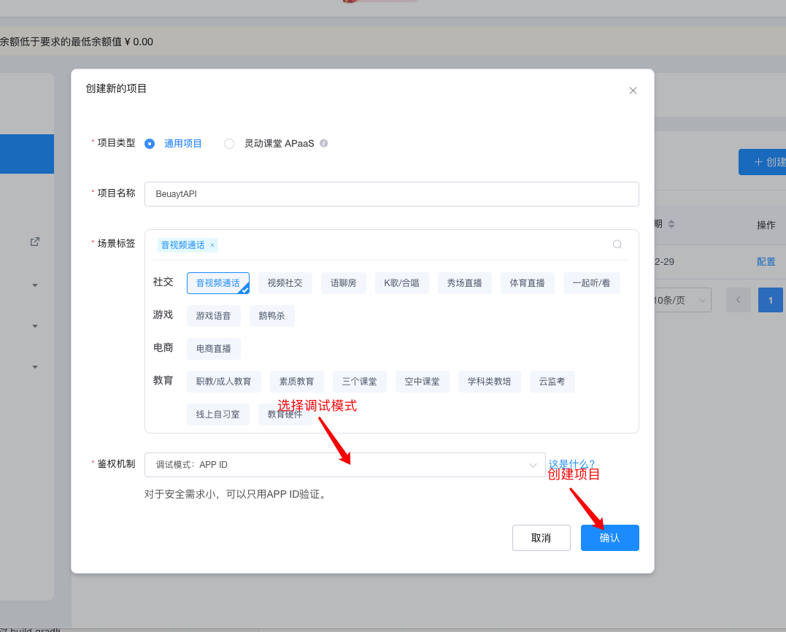
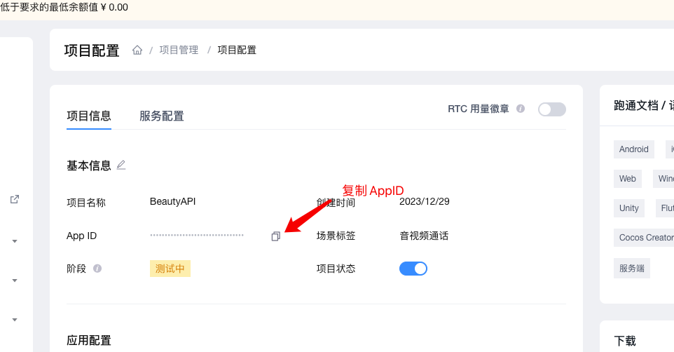

# 美颜场景化API Demo

[English](README.md) | 中文


> 本文档主要介绍如何快速跑通美颜场景化API示例代码。
> 
> **Demo 效果：**
>
> 
---


## 1. 前提条件

- 最低兼容 iOS 11
- Xcode 13及以上版本
- 联系商汤客服拿到商汤的美颜SDK、美颜资源以及证书
- 联系字节火山客户拿到火山SDK、美颜资源以及证书
- 联系相芯客户拿到美颜资源以及证书

---

## 2. 配置声网AppID

- 获取声网 App ID -------- [声网Agora - 文档中心 - 如何获取 App ID](https://docs.agora.io/cn/Agora%20Platform/get_appid_token?platform=All%20Platforms#%E8%8E%B7%E5%8F%96-app-id)
  > - 进入[控制台](https://console.shengwang.cn/)
  > 
  > - 点击创建应用
      > 
      > 
  >
  > - 选择调试模式并创建（本示例仅支持调试模式）
      >
      > 
  > 
  > - 复制 App ID
      >
      > 

- 编辑`BeautyAPi/KeyCenter.swift`，并填写上面复制的声网 App ID

	```
	static let AppId: String = #YOUR APP ID#
	```

---

## 3. 集成到项目

>  每个美颜可以单独集成到自己的项目，详见对应的集成说明文档
> 
> | 美颜    | 集成说明                                                |
> | --------- | ------------------------------------------------------------ |
> | 商汤 | [官网文档](https://doc.shengwang.cn/doc/showroom/ios/advanced-features/beauty/sensetime/integrate) |
> | 相芯 | [官网文档](https://doc.shengwang.cn/doc/showroom/ios/advanced-features/beauty/faceunity/integrate) |
> | 字节火山 | [官网文档](https://doc.shengwang.cn/doc/showroom/ios/advanced-features/beauty/bytedance/integrate) |
> | 宇宙    | 暂无                                                     |

---

## 4. 运行项目

1. 编辑`BeautyAPi Project`， 修改`Bundle Identifier`为申请美颜时所用包名
2. 运行项目

---

### 集成遇到困难，该如何联系声网获取协助

> 方案1：如果您已经在使用声网服务或者在对接中，可以直接联系对接的销售或服务；
>
> 方案2：发送邮件给 [support@agora.io](mailto:support@agora.io) 咨询
>
> 方案3：扫码加入我们的微信交流群提问
>
> 
---

## 代码许可

The MIT [License (MIT)](../LICENSE)